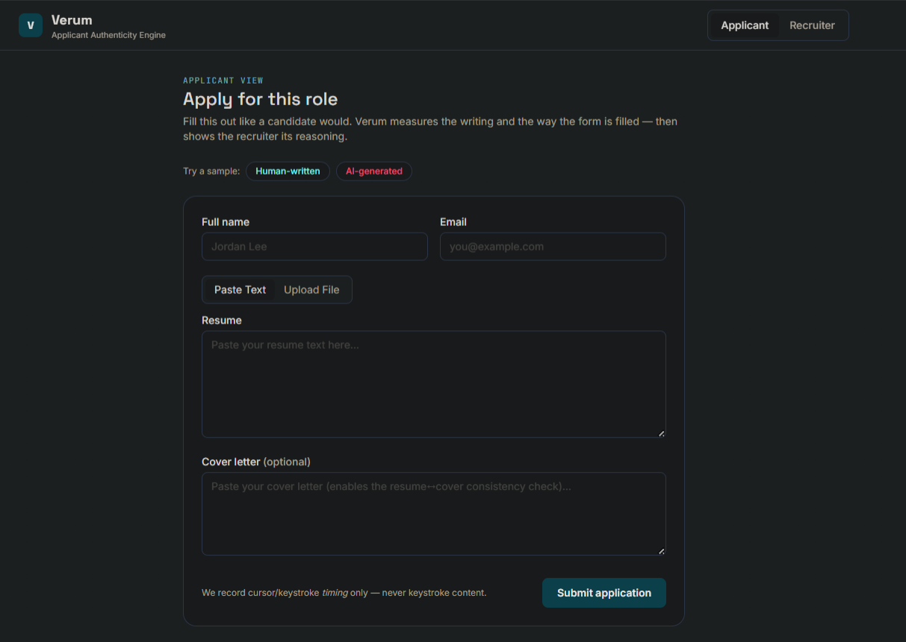
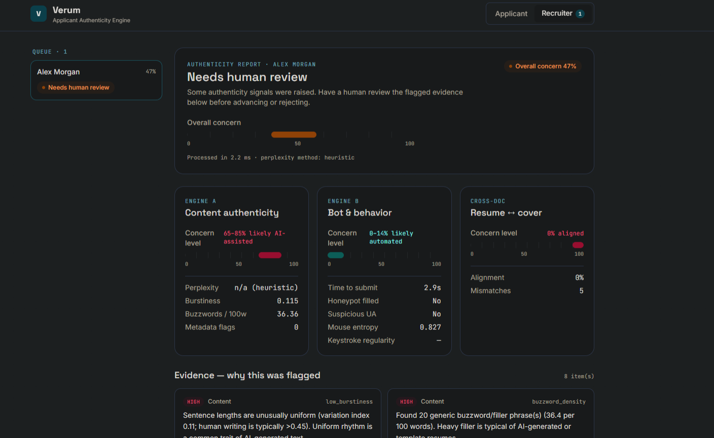
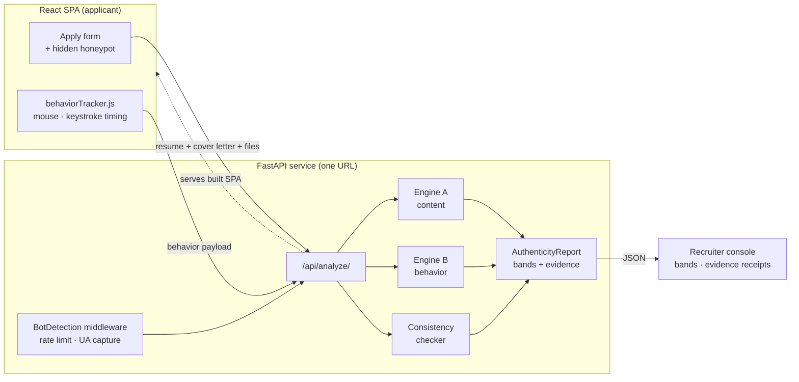

<div align="center">

# Verum

**Applicant Authenticity Engine**

Explainable screening for the age of AI-generated applications.
Verum flags AI-written resumes and bot-submitted applications — and *shows its evidence* for every call it makes.

[](https://www.python.org/)
[](https://fastapi.tiangolo.com/)
[](https://react.dev/)
[](https://vitejs.dev/)
[](https://www.docker.com/)
[](./LICENSE)

[Live demo](#live-demo) · [How it works](#how-it-works) · [Quick start](#quick-start) · [API](#api-reference) · [Configuration](#configuration)

</div>

---

## Table of Contents

- [What is Verum?](#what-is-verum)
- [Live demo](#live-demo)
- [Why explainability is the whole point](#why-explainability-is-the-whole-point)
- [How it works](#how-it-works)
  - [Engine A — Content authenticity](#engine-a--content-authenticity)
  - [Engine B — Submission authenticity](#engine-b--submission-authenticity)
  - [Cross-document consistency](#cross-document-consistency)
  - [Fusion](#fusion)
- [Architecture](#architecture)
- [Tech stack](#tech-stack)
- [Project structure](#project-structure)
- [Quick start](#quick-start)
- [API reference](#api-reference)
- [Testing](#testing)
- [Configuration](#configuration)
- [Engineering decisions](#engineering-decisions)
- [Privacy & ethics](#privacy--ethics)
- [Limitations](#limitations)
- [Roadmap](#roadmap)
- [License](#license)

---

## What is Verum?

Recruiters now receive a flood of applications where the resume was written by ChatGPT and the form was filled out by a script. Most "AI detectors" answer this with a single scary number — *"87% AI"* — that nobody can trust, explain, or appeal.

**Verum takes a different stance.** It runs two independent detection engines over each application and, instead of a verdict-in-a-black-box, it returns a **confidence band** plus a **receipt of evidence**: which sentences were unusually uniform, which buzzwords were stacked, whether the cover letter claims skills the resume never mentions, whether the form was submitted in 0.4 seconds by something that never moved a mouse.

> **Design principle:** Verum *never auto-rejects a candidate.* It routes the uncertain ones to a human with the evidence attached. A false positive should cost a second look — never someone's job opportunity.

---

## Live demo

> **Live app → [verum-zcf0.onrender.com](https://verum-zcf0.onrender.com)**
>
> _Hosted on Render's free tier — if the app has been idle it may take ~30–50 seconds to wake on the first request, then it's fast._

| Applicant view | Recruiter console |
| --- | --- |
|  |  |

Try it in seconds: the applicant form ships with **"Load human-written sample"** and **"Load AI-written sample"** buttons, so a reviewer can watch the two engines light up differently without typing a word.

---

## Why explainability is the whole point

| Typical AI detector | Verum |
| --- | --- |
| One number: *"87% AI"* | A **band**: *"68–88% likely AI-assisted"* — honest about its own uncertainty |
| No reasons given | An **evidence feed**: every flag names the signal, explains it in plain English, and highlights the exact text |
| Auto-rejects | **Routes to human review** — accessibility- and fairness-first |
| Text only | **Text + behavior + cross-document consistency**, fused into one report |

Fake precision is the enemy. A model that says "87.3%" is lying about its resolution; Verum reports a range because that is what the signals actually support.

---

## How it works

Verum fuses **three analyzers** into a single `AuthenticityReport`.

### Engine A — Content authenticity

`services/ai_analyzer.py` — detects AI-generated *writing* from several cheap, independent signals, no paid API required. It analyzes the résumé **and** the cover letter together, because flowing cover-letter prose is far more revealing than terse résumé bullets.

| Signal | What it measures | Why it flags AI |
| --- | --- | --- |
| **AI cadence phrases** | Stock phrasings current chat models overuse ("a testament to", "thrive in fast-paced environments", "not only… but also") | The strongest cheap tell against a modern LLM |
| **Buzzword / filler density** | Rate of generic filler ("results-driven", "leveraged", "passionate") per 100 words | AI-written applications stack corporate filler |
| **Em-dash character** | Use of the typographic "—" / "–" | People type a plain hyphen "-"; the em-dash *character* is a machine trait |
| **Triadic "rule of three"** | Parallel "X, Y, and Z" lists | Chat models lean on triads far more than most human writers |
| **Repeated openers** | Sentences starting with the same transition word | LLMs over-use "Furthermore / Moreover / Additionally" |
| **Burstiness** | Coefficient of variation of sentence lengths | Older models wrote uniformly — kept as a low-weight tie-breaker, since modern models vary sentence length on purpose |
| **Perplexity** *(optional)* | GPT-2 surprise score of the text | Low perplexity ≈ predictable ≈ machine-written |

> Modern frontier models defeat sentence-length ("burstiness") detection, so Engine A leans on **lexical and structural** tells — cadence phrasing, em-dash characters and triads — with burstiness as a minor tie-breaker. Perplexity uses HuggingFace `transformers` and is **off by default** so the app stays fast and deployable on a free tier — see [Configuration](#configuration).

### Engine B — Submission authenticity

`services/behavior_scorer.py` + `middleware/bot_detector.py` — detects *bots and scripts* from how the form was submitted, not from IP blocklists.

| Signal | What it measures |
| --- | --- |
| **Honeypot** | A hidden field no human can see; if it's filled, it's a bot |
| **Time-to-submit** | Sub-second submissions are non-human |
| **User-agent** | Flags `curl`, `python-requests`, `headless`, `selenium`, etc. |
| **Mouse entropy** | Shannon entropy of cursor movement angles — bots move in straight lines |
| **Keystroke rhythm** | Coefficient of variation of inter-key timings — bots type with metronomic regularity |
| **Rate limiting** | In-memory sliding window per IP (429 on abuse) |

> Behavioral signals capture **timing and geometry only** — never *what* you typed. See [Privacy & ethics](#privacy--ethics).

### Cross-document consistency

`services/consistency_checker.py` — compares the resume against the cover letter and flags skills or named entities (companies, tools) the cover letter claims but the resume never backs up — a classic "generated a cover letter separately" tell.

### Fusion

`main.py` fuses the three engines. A naïve weighted average has a dangerous blind spot: when a **real person** submits AI-written text, the bot score is legitimately near zero and would drag the average below the review line — hiding obvious AI writing. But these are *independent* concerns: AI-written text is worth a second look even if a human clicked submit. So the overall concern is the **higher** of a weighted blend and the strongest single engine:

```
blend   = 0.45 · bot  +  0.40 · ai_content  +  0.15 · inconsistency
overall = max( blend,  0.85 · ai_content,  0.90 · bot )
```

mapped to a verdict:

| Score | Verdict |
| --- | --- |
| `< 0.34` | Likely authentic |
| `0.34 – 0.66` | Needs human review |
| `> 0.66` | Strong AI/automation signals |

The floor is deliberately scaled (×0.85 / ×0.90), so a single engine has to be fairly confident to raise the alarm alone — which keeps genuine applicants from being flagged by one weak signal.

---

## Architecture



The built React app is served **by the FastAPI process itself** from `/static`, so the whole product runs as **one service at one URL** — no CORS in production, no second deployment.

---

## Tech stack

**Backend** — Python 3.11 · FastAPI · Pydantic v2 · Starlette middleware · pdfplumber · python-docx · (optional) PyTorch + Transformers
**Frontend** — React 18 · Vite 5 · Tailwind CSS 3.4
**Infra** — Docker (multi-stage) · docker-compose · Render blueprint
**Tests** — pytest

---

## Project structure

```
verum/
├── backend/
│   ├── app/
│   │   ├── main.py                 # FastAPI app, endpoints, report fusion, SPA hosting
│   │   ├── config.py               # env-driven settings (all knobs live here)
│   │   ├── schemas.py              # Pydantic request/response models
│   │   ├── services/
│   │   │   ├── ai_analyzer.py      # Engine A — content authenticity
│   │   │   ├── behavior_scorer.py  # Engine B — bot/behavior scoring
│   │   │   ├── consistency_checker.py  # resume ↔ cover-letter cross-check
│   │   │   └── pdf_parser.py       # PDF/DOCX text + metadata extraction
│   │   └── middleware/
│   │       └── bot_detector.py     # rate limiting + UA capture
│   ├── tests/test_engines.py       # engine unit tests
│   └── requirements.txt
├── frontend/
│   └── src/
│       ├── App.jsx                 # applicant / recruiter tab shell
│       ├── api.js                  # API client (same-origin in prod)
│       ├── components/             # ApplyForm, Dashboard, ScoreBand, EvidenceCard, EnginePanel
│       └── lib/                    # behaviorTracker.js, ui.js
├── Dockerfile                      # multi-stage: build UI → serve from API
├── docker-compose.yml
├── render.yaml                     # one-click Render blueprint
└── README.md
```

---

## Quick start

### Option A — Docker (one command)

```bash
docker compose up --build
# open http://localhost:8000
```

### Option B — Run locally for development

**1. Backend** (terminal 1)

```bash
cd backend
python -m venv .venv
source .venv/bin/activate        # Windows: .venv\Scripts\Activate.ps1
pip install -r requirements.txt
uvicorn app.main:app --reload    # http://localhost:8000
```

**2. Frontend** (terminal 2)

```bash
cd frontend
npm install
npm run dev                      # http://localhost:5173
```

In dev, the React app talks to the API at `http://localhost:8000`. In production, they're served from the same origin.

---

## API reference

| Method | Endpoint | Purpose |
| --- | --- | --- |
| `GET` | `/health` | Liveness probe |
| `POST` | `/api/analyze-text` | Analyze pasted resume/cover-letter text (JSON) |
| `POST` | `/api/analyze` | Analyze uploaded files + behavior (multipart) |

### Example — analyze text

```bash
curl -X POST http://localhost:8000/api/analyze-text \
  -H "Content-Type: application/json" \
  -d '{
    "resume_text": "I am a highly results-driven and detail-oriented professional...",
    "cover_letter_text": "At Google I leveraged TensorFlow to spearhead ML initiatives...",
    "behavior": { "form_load_time": 0, "submit_time": 9000, "honeypot": "" }
  }'
```

### Example response *(abridged, real output)*

```json
{
  "verdict": "Needs human review",
  "overall_flag_score": 0.51,
  "content": {
    "ai_likelihood_band": "68–88% likely AI-assisted",
    "ai_likelihood_score": 0.782,
    "burstiness": 0.075,
    "buzzword_density": 36.96,
    "evidence": [
      {
        "engine": "content",
        "signal": "low_burstiness",
        "detail": "Sentence lengths are unusually uniform (variation index 0.08; human writing is typically >0.45).",
        "severity": "high",
        "excerpt": "I am a highly results-driven and detail-oriented software professional."
      }
    ]
  },
  "consistency": {
    "consistency_score": 0.0,
    "mismatches": [
      "Skill 'tensorflow' is highlighted in the cover letter but not present in the resume.",
      "'At Google' is referenced in the cover letter but does not appear in the resume."
    ]
  },
  "behavior": {
    "bot_likelihood_band": "0–20% likely automated",
    "bot_likelihood_score": 0.104,
    "honeypot_triggered": false,
    "time_to_submit_seconds": 9.0
  },
  "limitations": "Verum surfaces signals, not proof. Always pair with human judgment; never auto-reject."
}
```

Every report ends with a `limitations` note — the honesty is built into the payload, not just the docs.

---

## Testing

```bash
cd backend
pip install -r requirements-dev.txt
pytest
```

The suite feeds a known **human-written** sample and a known **AI-written** sample through each engine and asserts they separate as expected (AI content scores high, honeypot trips, sub-second submits flag, human-like behavior stays low).

---

## Configuration

Every setting is read from an environment variable with a sensible default (see `backend/app/config.py`), so you can change behavior in deployment without touching code.

| Variable | Default | Purpose |
| --- | --- | --- |
| `USE_TRANSFORMER_PERPLEXITY` | `false` | Load GPT-2 to compute real perplexity. Heavy (~500 MB + torch); off by default so the app fits a free tier. When off, a fast statistical proxy is used instead. |
| `PERPLEXITY_MODEL` | `gpt2` | HuggingFace model used when the transformer path is enabled. |
| `MIN_SUBMIT_SECONDS` | `3.0` | Submissions faster than this (seconds) are treated as suspicious. |
| `RATE_LIMIT_MAX` | `30` | Max requests allowed per IP per window. |
| `RATE_LIMIT_WINDOW_SECONDS` | `60` | Length of the rate-limit window, in seconds. |
| `CORS_ORIGINS` | `localhost:5173,3000,127.0.0.1:5173` | Comma-separated allowed frontend origins (dev only; production is same-origin). |
| `REDIS_URL` | *(empty)* | Optional Redis URL to back rate limiting for multi-instance deploys. In-memory when empty. |

To enable the heavier model locally: un-comment `torch` and `transformers` in `backend/requirements.txt`, copy `backend/.env.example` to `backend/.env`, set `USE_TRANSFORMER_PERPLEXITY=true`, and restart the backend.

---

## Engineering decisions

**Bands, not fake-precise scores.** A detector that reports "87.3%" implies a resolution it does not have. Verum reports a ±10 band so the output is honest about its own uncertainty.

**Graceful degradation.** The heavy GPT-2 perplexity model is optional and off by default. The app runs in seconds on a 512 MB free tier using pure-Python stylometry; if you have the resources, `USE_TRANSFORMER_PERPLEXITY=true` upgrades Engine A in place — same interface, richer signal.

**One service, one URL.** Rather than deploy an API and a static site separately, the Dockerfile builds the React bundle and lets FastAPI serve it. Simpler ops, no production CORS, one thing to monitor.

**Evidence is a first-class object.** Every signal emits an `EvidenceItem(engine, signal, detail, severity, excerpt)`. The UI is just a renderer over that list — which means the "why" can never drift from the "what".

**Human-in-the-loop by construction.** There is no code path that rejects an applicant. The strongest verdict Verum can reach is *"route to a human with this evidence."*

---

## Privacy & ethics

- Behavioral tracking records **timing and cursor geometry only** — never keystroke *content*.
- Submissions live **in memory** for the session; nothing is persisted to a database by default.
- The honeypot field is invisible to humans and to screen-reader users (positioned off-screen with `aria-hidden` / `tabindex=-1`).
- **No candidate is ever auto-rejected.** Flags are decision-support for a human reviewer.

---

## Limitations

Verum surfaces *signals*, not proof. Skilled writers can trip the buzzword detector; strong AI text can read as bursty; a careful bot can fake human-ish timing. These heuristics are meant to **prioritize human attention**, not to deliver a verdict. Treat every flag as "worth a closer look," never as grounds for rejection.

---

## Roadmap

- Redis-backed rate limiting for multi-instance deploys (interface already stubbed in `config.py`)
- Optional persistence layer (Postgres) for an audit trail
- Per-signal weight tuning from a labeled dataset
- PDF layout/font forensics for template detection

---

## License

[MIT](./LICENSE) — free to use, learn from, and build on.
